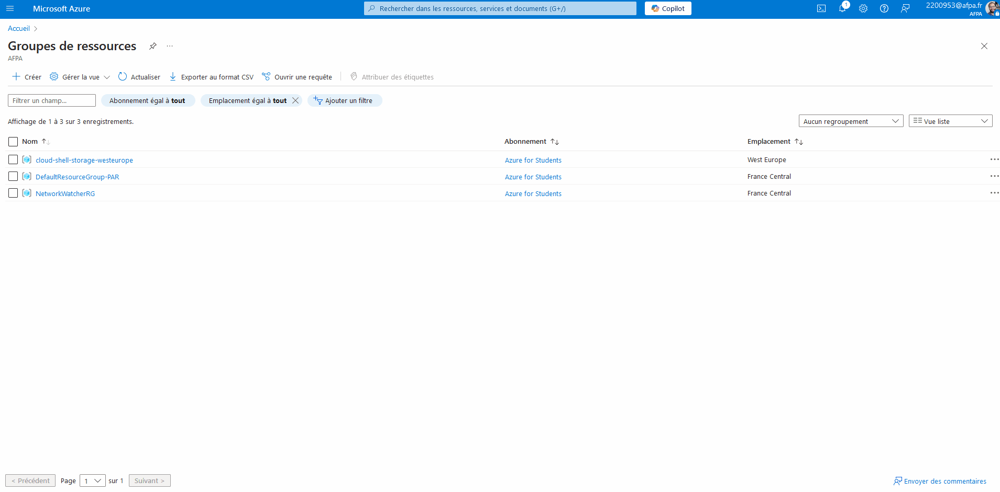
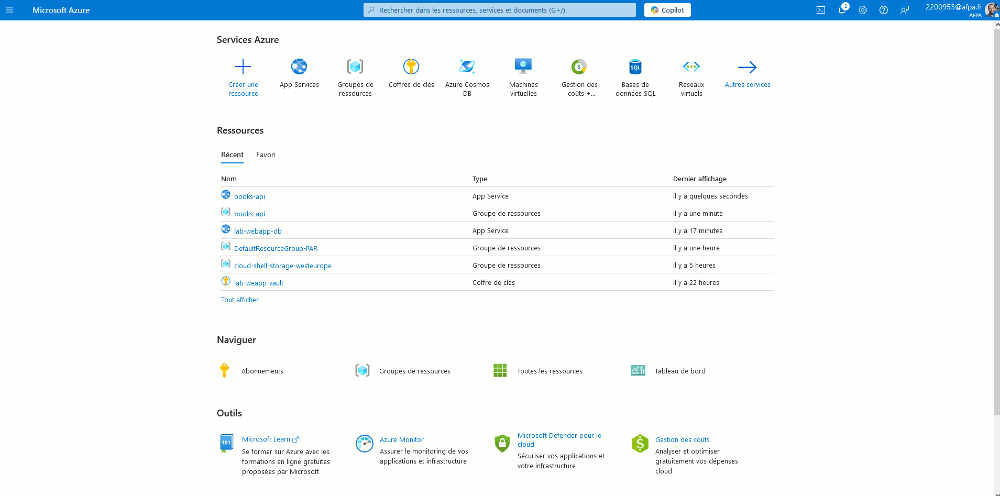
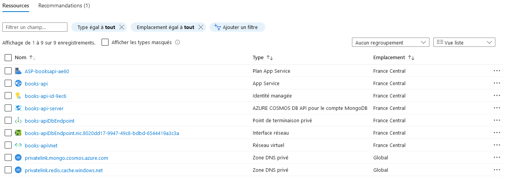

# CI/CD

## Préambule

Ce dépôt vous permettra de mettre en place un mécanisme de **déploiement continu** reposant sur :
- un hébergement Microsoft Azure ;
- code d'un projet hébergé sur Github.

L'objectif est de provoquer un **déploiement automatique** d'une Web API sur un conteneur Microsoft Azure. Ceci lors d'un "push" sur une branche spécifique.

La "stack technique" du projet proposé est la suivante :
- code serveur basé sur **ExpressJS** ;
- base de données MongoDB.

> [!NOTE]  
> Pré-requis :
> - un compte Microsoft Azure fonctionnel ;
> - un compte Github ;
> - connaissances de Github Action (un activité de mise en place est disponible [ici](https://github.com/afpa-learning/tests-continuous-integration))

## Procédure

> [!IMPORTANT]
> Ce qui suit est une simplification de la procédure accessible en [cliquant ici](https://learn.microsoft.com/fr-fr/azure/app-service/tutorial-nodejs-mongodb-app?tabs=copilot&pivots=azure-portal)

1. Créer un groupe de ressources au nom explicite.

2. Créer un nouveau service "Web App + DB" dans le nouveau groupe de ressources.

3. Ajouter la variable d'environnement `WEBSITE_RUN_FROM_PACKAGE = 1` au conteneur correspondant à l'application.

4. Déployer le code en lien avec un dépôt Git en utilisant le "Centre de déploiement" :
Le plugin "Github" du centre de déploiement crée automatiquement le fichier de configuration `ci.yml` dans le dossier `.github/workflows`

5. Provoquer un "push" sur la branche qui déclenche le "Github Action"

6. Configurer le conteneur de base de données

7. Créer un jeu de test en base de données

> [!ALERT]
> Si le pipeline "Github Action" bloque lors de la phase de déploiement sur Microsoft Azure ajoutez à votre "Application Web" Azure la variable d'environnement suivante :
> `WEBSITE_RUN_FROM_PACKAGE = 1`

Ci-dessous un descriptif plus détaillé des actions à effectuer.

### Mise en place de conteneurs "Application Web"

#### Création du "groupe de ressources"

#### Création "Web App + DB"

La création d'une "App service" entraîne la création de plusieurs conteneurs dans le groupes de ressource associé (cf. capture ci-après).

#### Modification des variables d'environnement

Ajouter la variable d'environnement `WEBSITE_RUN_FROM_PACKAGE = 1` au conteneur correspondant à l'application.

### Configuration du déploiement

#### Etablir le lien avec un dépôt Github existant

### Configuration de la base de données

#### Ouverture du firewall

### Ajout d'un jeu de données de test

